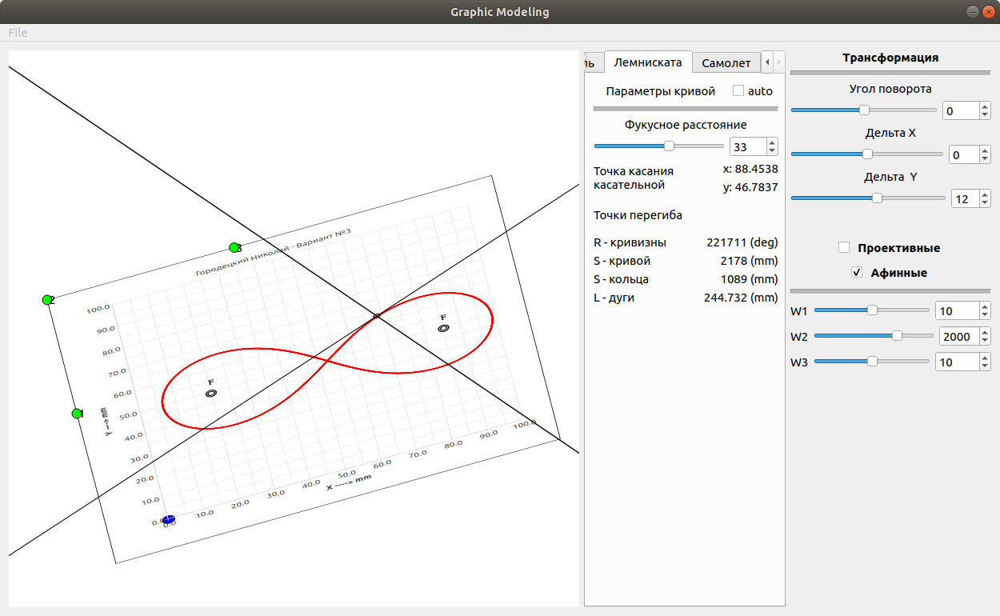

## QtGraphicsExample
Working with 2D modeling, using qt

### Gasket and Proective transformation

### Gasket and Affine transformation

### Lemniscate of Bernoulli, Tangent line and Affine transformation

### Plane, drawed by Quadratic Bézier curve

### Plane animation to Cat

